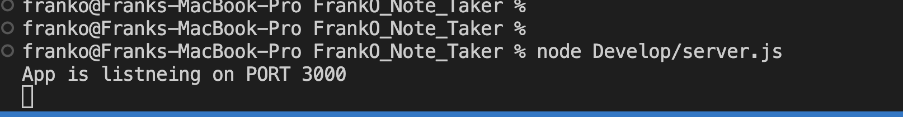
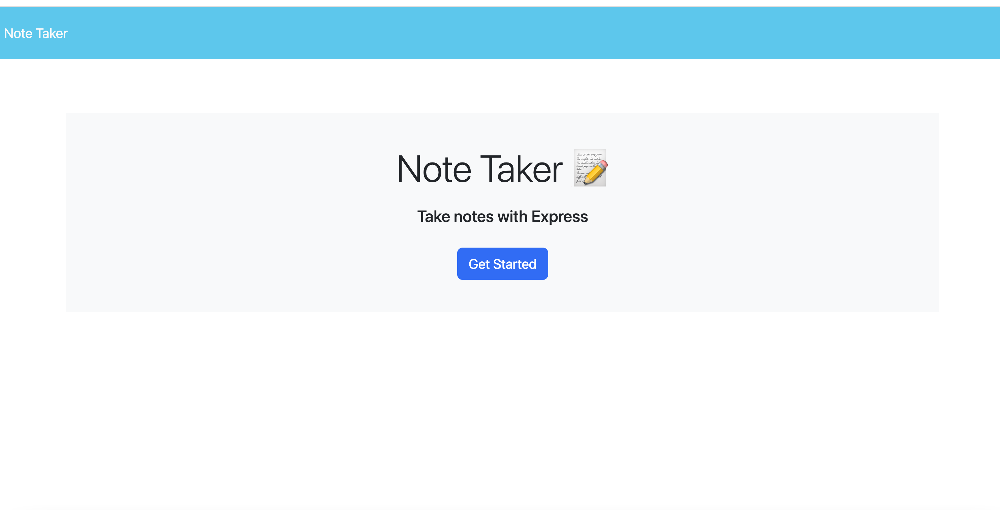

# FrankO_Note_Taker
 An application called Note Taker that can be used to write and save notes.This application will use an Express.js back end and will save and retrieve note data from a JSON file.

This application will be created for a small business owner so they will be able to write and save notes so they will be able to store notes and be organized with the tasks that they will need to complete.

This is a note-taking application for which when I open the note-taker then a landing page with a link to a notes page is presented. When I click on the page for notes then a page with existing notes will be listed in the left-hand column, plus empty fields to enter a new note title and the notes text will be in the right hand-column. When I enter a new note title and the notes text, a save icon will appear in the navigation at the top of the page. When I click the save icon, then a new note I have entered is saved appears in the left-hand coulmn with the other exisiting notes. When I click on a existing note in the list in the left-hand colmn, then that note will appear in the right hand-column. Lastly, when I click on the write icon in navigation at the top of the page an empty field is presented to enter a new note title and the notes text in the right-hand column.

Screenshot of backend server running:

Screenshot of frontend UI for note taker:
